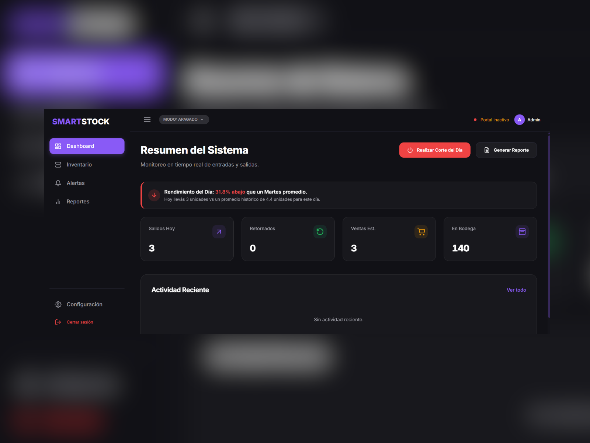
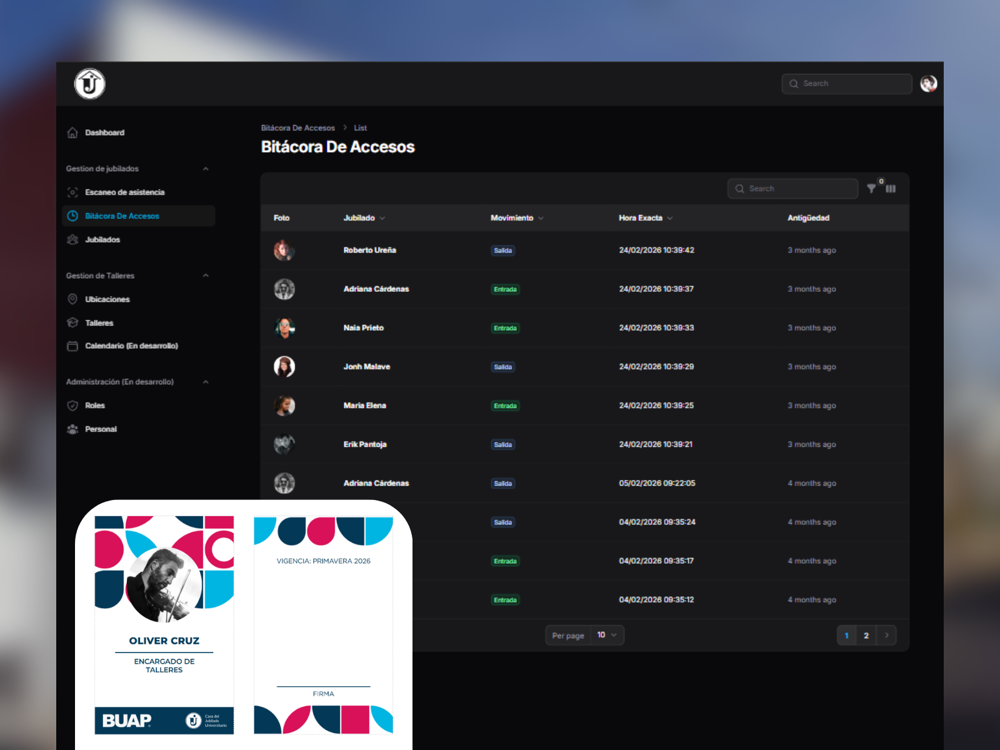

  <h1>Misael Reynoso</h1>
  
<strong>Desarrollador de Software & Estudiante de Ingeniería de Software</strong>

  
  

## Sobre mí

Estudiante de Ingeniería en Sistemas y Tecnologías de la Información en la Universidad del Valle de Puebla (UVP) con promedio académico de 9.9/10. Mi enfoque principal está en el desarrollo web full-stack con React, TypeScript y Laravel, además del diseño de flujos agénticos (Agentic Workflows) e integración de inteligencia artificial para la optimización de procesos.

*   **Desarrollo Full-Stack:** Creación de componentes web interactivos en React y TypeScript, y estructuración de arquitecturas y APIs robustas en Laravel.
*   **Automatización de Procesos:** Diseño de integraciones de sistemas y flujos de trabajo utilizando Power Automate e integración de APIs de modelos de lenguaje (LLMs).
*   **Liderazgo y Comunidad:** Ex-organizador del Google Developers Group (GDG) Puebla y creador del proyecto de difusión educativa @hatcode.dev en Instagram.

---

## Proyectos destacados

<table>
  <tr>
    <td width="48%" valign="top">
      <h3 align="center">SmartStock</h3>
      

        
        

           
          
          
        

      

      
Sistema IoT con tecnología RFID para la automatización de inventarios sin fricción. Integra analítica predictiva de demanda y reabastecimiento en tiempo real, digitalizando el control de existencias a través de portales de lectura automáticos.

      
<strong>Tecnologías:</strong> Next.js, React, Tailwind CSS, IoT APIs, Render.

    </td>
    <td width="4%"></td>
    <td width="48%" valign="top">
      <h3 align="center">Portal Web CJU</h3>
      

        
        

           
          
        

      

      
Plataforma administrativa institucional desarrollada para la Casa del Jubilado Universitario BUAP. Automatiza el registro de asistencia mediante códigos QR generados dinámicamente, además de gestionar la asignación de talleres e impresión de gafetes.

      
<strong>Tecnologías:</strong> Laravel, PHP, Blade, MySQL, QR Code Engine.

    </td>
  </tr>
  <tr>
    <td height="20"></td>
    <td></td>
    <td></td>
  </tr>
  
</table>

---

## Estadísticas de GitHub

  
  

